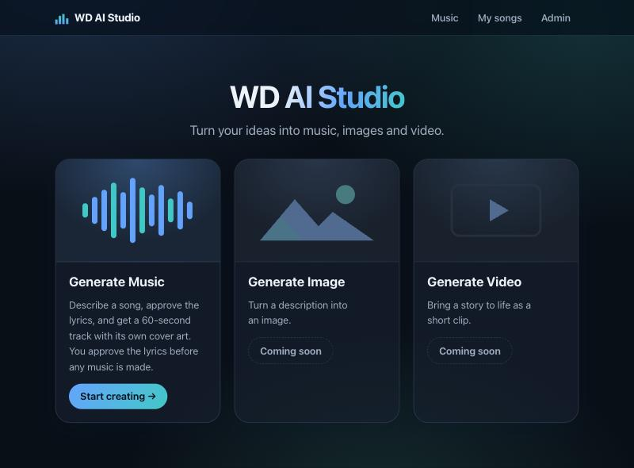
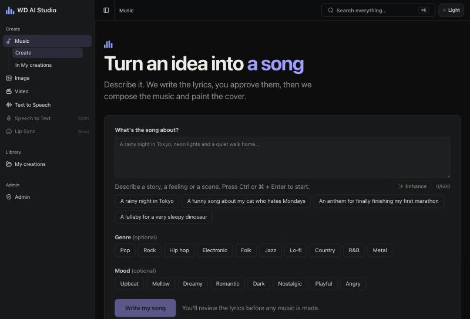
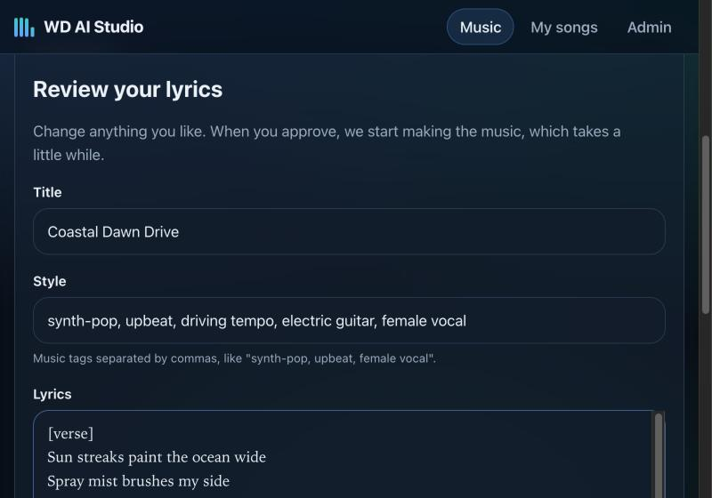
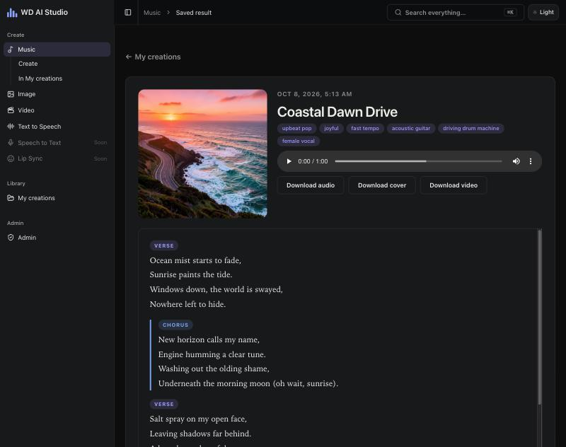
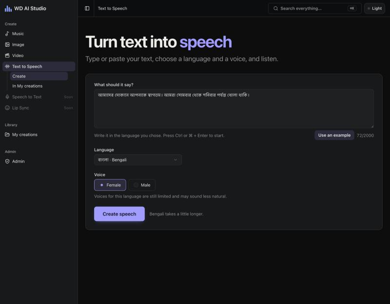
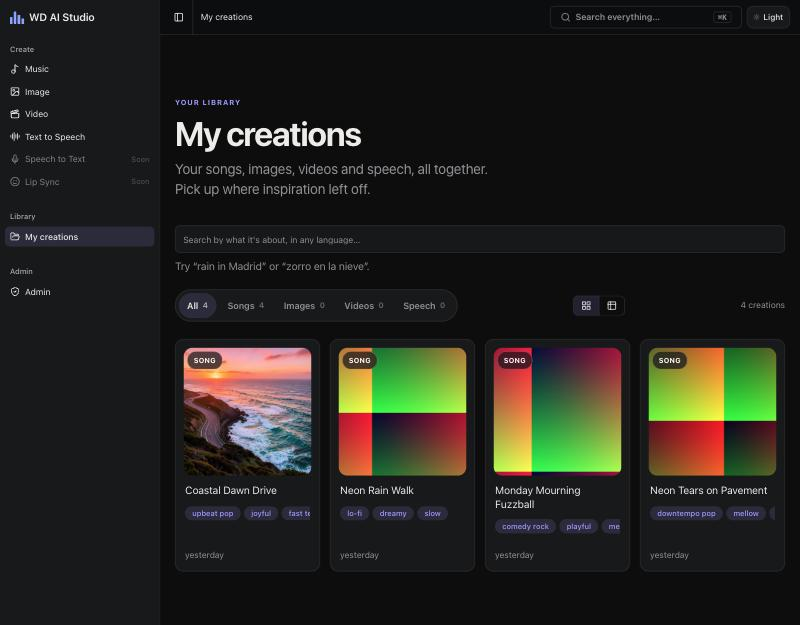
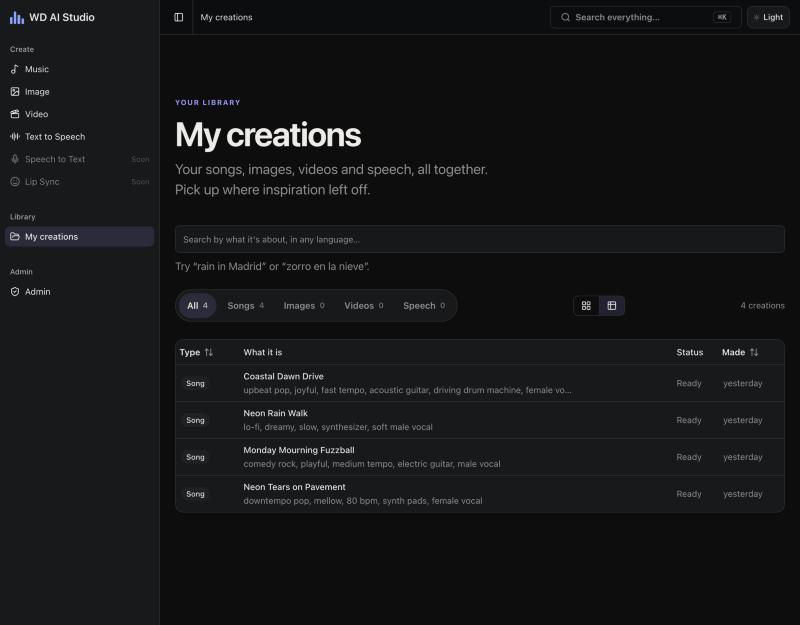
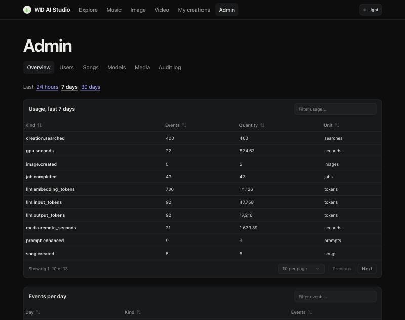

# wd-ai

A self-hosted, cloud-portable platform for launching AI products quickly.

The **platform core** provides the shared machinery every AI product needs: an API with
streaming, a stateful agent runtime, a model gateway, GPU media workers, storage, and
auth, monitoring, and (later) billing. Each **product** is a thin layer on top: a few
LangGraph graphs, a Next.js UI and a config file.

> **Status: prototype (v1 in progress).** Six products run end to end: **music**, **images**, **video**,
> **text to speech**, **speech to text** and **lip sync**. Everything a user makes lands in one library,
> **My creations**, searchable by meaning in any language. The whole system runs in containers and installs on
> a local Kubernetes cluster from a Helm chart, with monitoring and alerts to Telegram. Next are staging on a
> GPU box and a short GCP test, built with OpenTofu. See the [roadmap](docs/roadmap.md).

## Contents

- [How it works](#how-it-works)
- [Products](#products)
- [Quick start](#quick-start) (including [what to install first](#before-you-start-manual-prerequisites))
- [Monitoring](#monitoring)
- [Using the API](#using-the-api)
- [Project layout](#project-layout)
- [Configuration](#configuration)
- [Development](#development)
- [Environments](#environments)
- [Documentation](#documentation)
- [Principles](#principles)
- [Roadmap](#roadmap)

## How it works

```
Browser ─► Next.js (UI + BFF) ─► FastAPI + LangGraph ─► LiteLLM ─► Ollama / vLLM
                                        │
                                        ├─► Postgres (pgvector, checkpoints, jobs)
                                        ├─► Redis (job queue, pub/sub) ─► Media worker ─┬─► ComfyUI (images, music, video)
                                        │                                               ├─► Speech servers (Kokoro, Whisper,
                                        │                                               │   Indic Parler-TTS, IndicConformer)
                                        │                                               └─► Lip sync server (MuseTalk)
                                        └─► Object storage (SeaweedFS / S3 / GCS / Azure Blob)

Prometheus, Alertmanager, Grafana and Loki watch all of it and alert to Telegram.
```

1. The browser talks only to the **Next.js** app, which handles sign-in (Auth.js). Its route
   handlers (the BFF) check the session, attach a short-lived signed token, proxy to the API and
   pass the event stream through unchanged.
2. **FastAPI** runs the product's **LangGraph** graph and streams progress to the browser as
   Server-Sent Events: node status, tokens, interrupts, job progress, and a final result.
3. Graphs ask for **capabilities** (`text.chat`, `music.generate`, `image.generate`, `speech.synthesize`,
   `video.lipsync`), never for specific models. Config binds each capability to a provider.
4. Text goes through **LiteLLM**, an OpenAI-compatible gateway that maps aliases to Ollama
   (dev, staging) or vLLM / hosted APIs (prod).
5. Slow work (music, images, video, speech, lip sync) is never awaited inline. The graph enqueues a job in
   **Redis**, a **media worker** drives ComfyUI or a speech or lip sync server, and the graph resumes when the
   job finishes.
6. Graph state is checkpointed in **Postgres**, so a run can pause for user input and resume.
7. A set of **safeguards** (content moderation and per-user quotas) is one system-wide switch in the admin area:
   off by default for development, forced on in production
   ([ADR-0047](docs/decisions/0047-safeguards-switch.md)).

## Products

| Product | What it does |
|---|---|
| [`wd-music-ai`](products/wd-music-ai/README.md) | A song idea becomes lyrics you approve, a 60-second track and cover art |
| [`wd-image-ai`](products/wd-image-ai/README.md) | Text to image and image to image (FLUX.2 klein 4B) |
| [`wd-video-ai`](products/wd-video-ai/README.md) | Text to video and image to video, 2 or 5 seconds (LTX-Video 2B), made in the background |
| [`wd-tts-ai`](products/wd-tts-ai/README.md) | Text to speech in eight languages, a male and a female voice each (Kokoro; Bengali with Indic Parler-TTS) |
| [`wd-stt-ai`](products/wd-stt-ai/README.md) | Speech to text from a file or the microphone, 51 languages (Whisper; IndicConformer for the Indian languages) |
| [`wd-lipsync-ai`](products/wd-lipsync-ai/README.md) | A character picture and a voice, a song or a script (up to 5 minutes) become a talking clip (MuseTalk) |

A product is a folder under `products/` with its `product.yaml`, graphs, prompts and ComfyUI
workflows. Adding a product adds no API endpoints: the graph registry exposes registered
graphs through the same generic routes.

## Quick start

Do the [one-time prerequisites](#before-you-start-manual-prerequisites) for your platform, then
two commands do everything else:

```bash
git clone https://github.com/wasif-danesh/wd-ai.git && cd wd-ai
make setup      # installs missing tools, starts Podman + Ollama, pulls the model, creates .env
make dev        # starts the stack, waits for Postgres, runs migrations, follows logs
```

Then open http://localhost:3000, choose a product and make something. GPU media (music, images, video) are
placeholders by default; set `COMFYUI_MODE=real` in `.env` and run ComfyUI with the models for real ones (see
[products/wd-music-ai](products/wd-music-ai/README.md) and [Hardware notes](#hardware-notes)). Lip Sync runs on
its own server, which `make dev` starts once it is installed (`services/lipsync-musetalk/setup.sh`, about 4 GB;
see [products/wd-lipsync-ai](products/wd-lipsync-ai/README.md)).

Sign-in is off by default (`AUTH_MODE=stub` in `.env.example`: everyone is the dev user). To turn it on,
set `AUTH_MODE=jwt`, the two secrets and a provider's client id and secret: see
[Sign-in in apps/web](apps/web/README.md#sign-in).



Inside a product the side panel is the navigation (the home page keeps its cards):

| Create | Review the lyrics | Your song |
|---|---|---|
|  |  |  |

| Text to speech (Bengali) | My creations | The same, as a table |
|---|---|---|
|  |  |  |

The admin area uses the same components for its data tables (sorting, a filter box, paging):



If `make` is not installed yet (common on a fresh Linux box), run the script directly. It
installs `make` for you: `./scripts/setup.sh`, then `make dev`.

### Before you start (manual prerequisites)

`make setup` installs almost everything, but a few things must exist first because they need
administrator rights, a reboot, or are needed to run the setup at all. Do these once.

**Every platform**

- An internet connection, and about 15 GB of free disk (the default model is about 10 GB).
- 8 GB of RAM or more for the default `gemma4:e4b` model (16 GB is more comfortable). With less, switch to a smaller model
  (see [Hardware notes](#hardware-notes)).
- A GPU is optional. Apple Silicon (Metal) and NVIDIA GPUs speed up replies; CPU-only works but
  is slow.

**macOS**

1. Install [Homebrew](https://brew.sh).
2. Install Apple's command line tools (they provide `git` and `make`): `xcode-select --install`.

**Linux** (Debian, Ubuntu, Kali, Fedora, Arch and derivatives)

1. Use a distro with `apt`, `dnf` or `pacman`, and an account with `sudo`.
2. Install `git` (for example `sudo apt install git`). `make`, `curl` and `openssl` are installed
   by setup if missing.
3. For the local Kubernetes cluster only (`make kind-up`) with rootless Podman, enable cgroup
   delegation once: [runbooks/linux-kind.md](docs/runbooks/linux-kind.md).

**Windows 10 (22H2) or 11**: use WSL2 with Ubuntu. Native PowerShell and cmd are not supported.

1. Turn on hardware virtualisation in the BIOS/UEFI, and use an administrator account.
2. From an elevated PowerShell, run `wsl --install -d Ubuntu-24.04`, reboot if asked, and finish
   the Ubuntu first-run user setup.
3. Optional but recommended: enable systemd in Ubuntu (`printf '[boot]\nsystemd=true\n' | sudo tee /etc/wsl.conf`),
   then run `wsl --shutdown` from PowerShell and reopen Ubuntu.
4. For GPU acceleration, install a current NVIDIA driver on **Windows**, not inside Linux.
5. Clone the repo inside Ubuntu's own filesystem (`~`), not under `/mnt/c`, then follow the Linux
   steps above.

Details and tips: [docs/windows.md](docs/windows.md).

### Supported platforms

| Platform | Status |
|---|---|
| macOS (Apple Silicon and Intel) | Supported; Homebrew and Xcode command line tools required first |
| Linux: Debian, Ubuntu, Kali (apt), Fedora (dnf), Arch (pacman) | Supported; the tool installation is tested in Ubuntu and Fedora containers and in CI. Engine, Ollama and model steps are tested on macOS only |
| Windows 10/11 | Supported **through WSL2** (Ubuntu); see [docs/windows.md](docs/windows.md). Not yet tested on a real Windows machine |

### What `make setup` does

It is idempotent (safe to re-run) and asks before every install or large download. Add `-y`
(`./scripts/setup.sh -y`) to accept everything without prompts. `make setup-k8s` does the same
and also installs `kind`, `helm` and `kubectl`.

1. Checks for `podman`, `uv`, `pnpm`, Node 22+, `ollama`, `curl`, `git`, `make`, `openssl` and a
   Compose provider, and installs what is missing:
   - **macOS:** Homebrew.
   - **Linux and WSL:** the distro package manager for system tools (`podman`, `git`, ...), plus
     official installers for the rest: `uv` and Ollama use their vendors' install scripts, and
     Node 22, `kind`, `helm` and `kubectl` are downloaded as binaries and **checksum-verified**
     into `~/.local/bin`. pnpm comes from Corepack. No Homebrew or sudo is needed for those.
2. Creates and starts the Podman VM on macOS, and checks it has enough memory (offers to resize).
3. Starts Ollama and pulls every model named in `services/api/src/wd_api/model_defaults.yaml`
   (`gemma4:e4b`, about 10 GB, plus `nomic-embed-text` and the multilingual `bge-m3`, about 1.5 GB together). On Linux it also checks that containers can reach Ollama and
   offers a fix if not.
4. Creates `.env` from `.env.example` and generates random secrets. Nothing is printed.
5. Runs `uv sync --all-packages` and `pnpm install`.

Anything it cannot do for you is listed under
[Before you start](#before-you-start-manual-prerequisites); the script stops with a message if
something is missing.

`make dev` runs `make preflight` first: a fast, read-only check that lists exactly what is
missing and points back to `make setup`.

### Hardware notes

- `gemma4:e4b` needs about 8 GB of RAM and 15 GB of free disk. Setup warns when a machine is
  short. To use a smaller or faster model, change the `ollama_chat/...` entries in
  `services/api/src/wd_api/model_defaults.yaml` (or switch a model at run time in `/admin/models`); setup and
  preflight read the model names from that file.
- Text to speech runs on the CPU in containers. English, Spanish, French, Hindi, Italian and Portuguese use
  Kokoro (small). **Bengali** uses Indic Parler-TTS, which needs about 4.5 GB of memory on its own and runs
  about five times slower than real time on a CPU, so give the Podman VM about **12 GB** (`podman machine set
  --memory 12288`). Its model is gated: accept the terms on its Hugging Face page and put a read token in
  `.env` as `HF_TOKEN` ([products/wd-tts-ai](products/wd-tts-ai/README.md)).
- The lip sync server (MuseTalk) runs natively on the Mac so it can use the Apple GPU: about 12 GB of memory
  and 5 seconds of compute per second of video. `make dev` starts and `make down` stops it.
- Ollama runs natively on the host so it can use the GPU. On Apple Silicon it uses Metal. On
  Intel Macs and machines without a supported GPU it runs on CPU, so replies are slow.
- Linux and WSL: Ollama listens on `127.0.0.1` by default, which containers may not reach.
  `make setup` tests this and, with your consent, makes Ollama listen on `0.0.0.0`. Ollama has no
  authentication, so restrict port 11434 with a host firewall.

### Services

| Service | URL |
|---|---|
| Web (Next.js) | http://localhost:3000 |
| API (FastAPI) | http://localhost:8000 (`/health`, `/docs`) |
| LiteLLM | http://localhost:4000 |
| Object storage (S3 API) | http://localhost:8333 |
| Speech servers: Kokoro and Whisper (Speaches) / Indic Parler-TTS / IndicConformer | http://localhost:8100 / :8101 / :8102 |
| Lip sync server (MuseTalk, native) | http://localhost:8191 |
| Postgres / Redis | `localhost:5432` / `localhost:6379` |

`make logs` follows container logs, and `make down` stops everything.

### Run on Kubernetes (kind)

Runs the same Helm chart used for staging, on a local cluster. `make setup-k8s` installs `kind`, `helm` and
`kubectl`. On Linux with rootless Podman see [runbooks/linux-kind.md](docs/runbooks/linux-kind.md).

```bash
make down         # the Compose stack and kind both use localhost:3000
make kind-up      # builds images, creates the cluster, installs the chart and the monitoring stack
make kind-test    # smoke test: migrations, every product's pages and APIs, the pods that replace native services
make kind-e2e     # makes something with each of the six products
make kind-down    # delete the cluster
```

The default `KIND_MODE=full` runs **every service as a pod, nothing native**: Ollama with its models, the CPU
speech servers, the lip sync server (CPU) and ComfyUI, plus Prometheus, Alertmanager, Grafana and Loki. It needs a
Podman VM of about 24 GB of memory and 100 GB of disk (`podman machine set --memory 32768 --disk-size 160`) and
downloads about 20 GB of models on the first start. There is no GPU in the cluster, so GPU media (images, music,
video) are placeholders, apart from one model-free ComfyUI graph the smoke test runs for real. `KIND_MODE=light`
is what CI runs: no models. `KIND_SAFEGUARDS=1` turns the production safeguards on. Home lab setup with k3s and
Argo CD: [runbook](docs/runbooks/homelab-k3s.md).

### Where everything is

`make urls` prints this for the mode that is running and says what answers right now.

<!-- urls:start -->
| Service | What it is | Compose (`make dev`) | kind (`make kind-up`) |
|---|---|---|---|
| Web app | the six products, My creations, admin | `http://localhost:3000` | `http://localhost:3000` |
| Admin area | users, models, media backends, safeguards, audit | `http://localhost:3000/admin` | `http://localhost:3000/admin` |
| API docs | Swagger UI for the API | `http://localhost:8000/docs` | `kubectl -n wd-ai port-forward svc/wd-ai-api 8000:8000`, then `http://localhost:8000/docs` |
| LiteLLM | the model gateway | `http://localhost:4000` | `kubectl -n wd-ai port-forward svc/wd-ai-litellm 4000:4000`, then `http://localhost:4000` |
| Object storage | S3 API (SeaweedFS) | `http://localhost:8333` | `kubectl -n wd-ai port-forward svc/wd-ai-storage 8333:8333`, then `http://localhost:8333` |
| Speech: Kokoro, Whisper | text to speech, speech to text | `http://localhost:8100` | `kubectl -n wd-ai port-forward svc/wd-ai-speech 8100:8000`, then `http://localhost:8100` |
| Speech: Indic Parler-TTS | Bengali and other Indic voices | `http://localhost:8101` | not in the cluster |
| Speech: IndicConformer | speech to text for Indian languages | `http://localhost:8102` | not in the cluster |
| Lip sync server | MuseTalk | `http://localhost:8191` | `kubectl -n wd-ai port-forward svc/wd-ai-lipsync 8191:8000`, then `http://localhost:8191` |
| ComfyUI | images, music (and video on :8189) | `http://localhost:8188` | `kubectl -n wd-ai port-forward svc/wd-ai-comfyui 8188:8188`, then `http://localhost:8188` |
| Ollama | the language models | `http://localhost:11434` | `kubectl -n wd-ai port-forward svc/wd-ai-ollama 11434:11434`, then `http://localhost:11434` |
| Postgres | database, checkpoints, usage events | `localhost:5432` | `kubectl -n wd-ai port-forward svc/wd-ai-postgres 5432:5432`, then `localhost:5432` |
| Redis | job queue and run events | `localhost:6379` | `kubectl -n wd-ai port-forward svc/wd-ai-redis 6379:6379`, then `localhost:6379` |
| Grafana | dashboards and logs | not installed | `kubectl -n monitoring port-forward svc/monitoring-grafana 3001:80`, then `http://localhost:3001` |
| Prometheus | metrics and alert rules | not installed | `kubectl -n monitoring port-forward svc/monitoring-prometheus 9090:9090`, then `http://localhost:9090` |
| Alertmanager | what is firing, where it goes | not installed | `kubectl -n monitoring port-forward svc/monitoring-alertmanager 9093:9093`, then `http://localhost:9093` |
| Healthchecks.io | the outside heartbeat | not installed | `https://healthchecks.io` |
<!-- urls:end -->

LangGraph has no interface of its own: it runs inside the API. Run state is in Postgres (the checkpoint tables),
the job queue is Redis Streams (`wd:jobs`, `wd:done`), and logs and metrics are in Grafana.

### Monitoring

```bash
make monitoring-up      # Prometheus, Alertmanager, Grafana, Loki; part of make kind-up
make monitoring-drill   # stop the worker and expect an alert on Telegram, then a resolve
make monitoring-drill-meta   # stop Prometheus and expect Healthchecks.io to message you
```

Alerts go to Telegram (`TELEGRAM_BOT_TOKEN`, `TELEGRAM_CHAT_ID` in `.env`), and a heartbeat to Healthchecks.io
(`HEALTHCHECKS_PING_URL`) tells you when the whole cluster is down. Dashboards, alert list and fire drills:
[runbook](docs/runbooks/monitoring.md), [ADR-0048](docs/decisions/0048-monitoring-and-alerting.md).

### Develop with live reload

Start only the backing services, then run the API and web app natively:

```bash
podman compose up -d postgres redis litellm
DATABASE_URL=postgresql+asyncpg://wd:wd@localhost:5432/wd \
  LITELLM_BASE_URL=http://localhost:4000 \
  uv run uvicorn wd_api.main:app --reload --port 8000
API_BASE_URL=http://localhost:8000 pnpm --filter web dev      # in another terminal
```

## Using the API

All routes resolve an identity on every request: a signed token from the web app (`AUTH_MODE=jwt`,
the default) or the dev user (`AUTH_MODE=stub`, set in `.env.example` for local work).
Without a valid token every route except `/health` answers `401`. Responses for runs are `text/event-stream`.

| Method and path | Purpose |
|---|---|
| `GET /health` | Liveness check (no identity needed) |
| `POST /products/{product_id}/runs` | Start a run; streams events. Body: `{"input": {...}, "thread_id"?: uuid}` |
| `GET /runs/{run_id}/events` | Reconnect to a run; honours `Last-Event-ID` |
| `POST /runs/{run_id}/resume` | Answer an `interrupt` (approve, edit); continues the stream. Body: `{"value": ...}` |
| `GET /me` | The caller's user id, tenant and role |
| `GET /admin/media`, `PUT /admin/media/{product}/{capability}`, `POST .../test`, `.../reset` | Admin only: choose which backend runs a product's media capability; keys are write-only |
| `GET /admin/models`, `PUT /admin/models/{alias}`, `POST /admin/models/{alias}/test`, `/reset` | Admin only: see and change which provider and model serve each LiteLLM alias; keys are write-only |
| `GET /admin/users`, `/admin/songs`, `/admin/usage?days=`, `/admin/audit` | Admin only (`403` for others): users, songs from all users, usage totals, the audit log. Listing users is itself audited |
| `POST /products/{id}/uploads/images` (raw image body) | Store the user's picture (re-encoded, metadata-free) and return its key ([ADR-0035](docs/decisions/0035-image-uploads.md)) |
| `GET /creations/search?q=&kind=&limit=` | Search the signed-in user's own creations by meaning and exact words, in any language ([ADR-0041](docs/decisions/0041-semantic-search.md)); every list route also takes `ids=` |
| `POST /products/{id}/prompt/enhance` | Rewrite the user's prompt for the product's model ([ADR-0038](docs/decisions/0038-prompt-enhancement.md)) |
| `DELETE /products/{id}/uploads/images/{upload_id}` | Take back an uploaded picture ([ADR-0039](docs/decisions/0039-picture-input.md)) |
| `GET /products/wd-tts-ai/voices`, `GET /products/wd-tts-ai/speeches`, `GET/DELETE /products/wd-tts-ai/speeches/{id}`, `.../download` | The voice catalog (languages, male and female voices), and the signed-in user's speech with an MP3 download ([ADR-0042](docs/decisions/0042-text-to-speech.md)) |
| `POST /products/wd-stt-ai/uploads/media` (raw body), `GET /products/wd-stt-ai/languages`, `GET /products/wd-stt-ai/transcripts`, `GET/DELETE .../transcripts/{id}`, `.../download?format=txt\|srt\|vtt\|json` | A recording or video becomes a clean WAV; the languages; the signed-in user's transcripts ([ADR-0043](docs/decisions/0043-speech-to-text.md)) |
| `GET /products/wd-lipsync-ai/lipsyncs`, `GET/DELETE .../lipsyncs/{id}`, `.../download`; uploads of a picture and a voice (at most 5 minutes) | The signed-in user's lip syncs, including ones still being made ([ADR-0044](docs/decisions/0044-lip-sync.md)) |
| `GET /products/wd-video-ai/videos`, `GET/DELETE /products/wd-video-ai/videos/{id}`, `.../download` | The signed-in user's clips, including ones still being made ([ADR-0037](docs/decisions/0037-video-product.md)) |
| `GET /products/wd-image-ai/images`, `GET/DELETE /products/wd-image-ai/images/{id}`, `.../download` | The signed-in user's images ([ADR-0036](docs/decisions/0036-image-product.md)) |
| `GET /products/wd-music-ai/songs`, `GET /products/wd-music-ai/songs/{id}` | The signed-in user's songs, with presigned audio and cover links (product-provided routes, [ADR-0023](docs/decisions/0023-product-provided-routes.md)) |
| `GET/PUT /admin/safeguards` | Admin only: the system-wide safeguards switch ([ADR-0047](docs/decisions/0047-safeguards-switch.md)) |

Try it without the browser, through the Next.js BFF:

```bash
curl -N -X POST localhost:3000/api/products/hello/runs \
  -H 'content-type: application/json' -d '{"input":{"message":"Say hi"}}'
```

You should see `node`, `token` ... and `done` events. Each message looks like:

```
id: 2
event: token
data: {"run_id":"…","thread_id":"…","seq":2,"ts":"…","node":"hello","text":"Hello"}
```

Event types are `node`, `token`, `interrupt`, `job_progress`, `error` and `done`. Full protocol:
[SSE event contract](docs/contracts/sse-events.md). Interactive docs are at
http://localhost:8000/docs.

## Project layout

```
wd-ai/
├─ apps/web/                 # Next.js app (shadcn/ui, Tailwind, TanStack Table): product UIs, side panel, admin, BFF
├─ services/
│  ├─ api/                   # FastAPI + LangGraph runtime (graphs, runs, identity, migrations, metrics)
│  ├─ media-worker/          # Redis consumer that drives ComfyUI, the speech servers and the lip sync server
│  ├─ comfyui/               # ComfyUI container image (CPU by default, CUDA by build argument)
│  ├─ lipsync-musetalk/      # the lip sync server (MuseTalk): image, setup script, model fetcher
│  ├─ speech-indic/          # small speech server for Indic Parler-TTS (Bengali)
│  └─ stt-indic/             # small transcription server for IndicConformer (Indian languages)
├─ packages/
│  ├─ contracts/             # Pydantic models: SSE events and request bodies (source of truth)
│  ├─ contracts-ts/          # TypeScript types generated from the OpenAPI schema
│  └─ platform-sdk/          # Capabilities, providers, product config, storage, usage, graph registry
├─ products/
│  ├─ hello/, media-demo/    # sample products: config only (used by the smoke tests)
│  ├─ wd-music-ai/           # song graph, guardrail, prompts, workflows, evals, tests
│  ├─ wd-image-ai/           # text to image and image to image
│  ├─ wd-video-ai/           # text to video and image to video
│  ├─ wd-tts-ai/             # text to speech: voice catalog, graph, guardrail
│  ├─ wd-stt-ai/             # speech to text: languages, transcripts, formats
│  └─ wd-lipsync-ai/         # lip sync: graph, guardrails, store, search
├─ deploy/
│  ├─ compose/               # LiteLLM config for the local stack
│  ├─ helm/wd-ai/            # Helm chart + values overlays (local, staging, prod, cloud/*)
│  ├─ monitoring/            # values for the monitoring stack and the Alertmanager template
│  ├─ kind/                  # local cluster config
│  └─ argocd/                # Argo CD Application for staging
├─ scripts/                  # setup, preflight, dev, kind, monitoring and install helpers
├─ docs/                     # architecture, ADRs, contracts, runbooks, roadmap
├─ compose.yaml              # local dev stack
└─ Makefile                  # setup, dev, test, lint, contracts, migrate, kind-*, monitoring-*
```

Python packages are snake_case (`wd_api`); folders and URLs are kebab-case.

## Configuration

There are three kinds of configuration, each with one home:

| Kind | Examples | Where |
|---|---|---|
| Secrets | API keys, DB passwords, `AUTH_SECRET`, `API_AUTH_SECRET`, OAuth client secrets | `.env` (gitignored); keys are listed in `.env.example` |
| Environment wiring | `DATABASE_URL`, `LITELLM_BASE_URL`, `OLLAMA_BASE_URL`, `COMFYUI_BASE_URL` | `.env` locally, Helm values on Kubernetes |
| Product config | Model bindings, workflows, quotas | `products/<id>/product.yaml` |

Containers reach Ollama and ComfyUI on the host through `host.containers.internal`, because
containers on macOS cannot use the Metal GPU. Never commit `.env`; the repo and container
builds ignore it. More detail: [Configuration](docs/configuration.md).

## Development

```bash
make test        # Python (no GPU or network needed) + TypeScript tests
make test-integration   # real Postgres/pgvector, Redis pipeline, SeaweedFS, LiteLLM + Ollama (needs make dev)
make test-comfyui       # opt-in: a real image, song and cover on your local ComfyUI (slow first time)
make lint        # ruff, pyright, Biome, tsc
make format      # ruff format + autofix
make contracts   # regenerate TS types from the API's OpenAPI schema
make setup       # one-time machine setup (see Quick start); setup-k8s adds kind/helm/kubectl
make preflight   # read-only readiness check
make dev / down  # start (with migrations) / stop the container stack
make migrate     # alembic upgrade head only (Postgres on localhost)
make helm-lint   # lint and render the chart with every overlay
make kind-up / kind-test / kind-e2e / kind-down   # local Kubernetes (see above)
make monitoring-up / monitoring-drill             # monitoring stack and fire drill
```

- **Tooling:** Python 3.12 with `uv`, `ruff`, `pyright`, `pytest`, Alembic. TypeScript with
  `pnpm`, Turborepo, Biome, Vitest, Next.js App Router in strict mode. UI: shadcn/ui (Radix) with Tailwind CSS, react-hook-form and Zod for forms, TanStack Table for data grids ([ADR-0045](docs/decisions/0045-ui-components.md)); `apps/web/app/tailwind.css` is the only stylesheet.
- **Contracts:** Pydantic models are the source of truth. Never hand-edit
  `packages/contracts-ts/src/schema.gen.ts`; run `make contracts`.
- **Tests:** graph tests use a fake capability provider, so they need no GPU or network.
- **Commits:** [Conventional Commits](https://www.conventionalcommits.org), scoped by area,
  e.g. `feat(api): ...`.
- **Containers:** use `${CONTAINER_ENGINE:-podman}` in scripts, never hard-code an engine.
  Images build for `linux/arm64` and `linux/amd64`.
- **CI:** GitHub Actions runs lint, typecheck and tests, a `setup` job on Ubuntu and macOS, a
  Helm lint and `kind` smoke test, and on `main` builds and pushes multi-arch images.

### Troubleshooting

| Symptom | Fix |
|---|---|
| No reply, or an error on the page | Check Ollama is up and lists the model: `curl localhost:11434/api/tags` |
| LiteLLM exits at start | `podman logs wd-ai-litellm-1`. It needs `LITELLM_API_KEY` set in `.env` |
| Port already in use | `make down`, then try again |
| Slow first reply | The model loads into memory on first use. CPU-only machines are slower; try `gemma4:e2b` |
| Empty reply with a small `max_tokens` | Gemma 4 "thinking" uses the token budget. It is off for the chat and lyrics aliases; keep budgets generous for the `moderator` ([ADR-0018](docs/decisions/0018-default-text-model-gemma4-e4b.md)) |
| Every model call fails with "model not found" right after start | The API seeds the model aliases into LiteLLM when it starts; give it a minute and check `podman logs wd-ai-api-1`. `LITELLM_API_KEY` must match between the API and LiteLLM |
| "API keys can't be saved yet" in `/admin/media` | `MEDIA_SECRETS_KEY` is missing: run `make setup`, then restart the API and the worker |
| `make dev` fails with "LITELLM_SALT_KEY" | Run `make setup`; it generates the key. Never change it afterwards: saved provider keys are encrypted with it |
| `podman compose` cannot connect | Run `podman machine start` |
| `make dev` says "Not ready" | Run `make setup`; it fixes every item the preflight lists |
| Sign-in page says "No sign-in provider is set up" | Set a provider's `AUTH_<PROVIDER>_ID` and `_SECRET` in `.env`, or `AUTH_MODE=stub` for local work |
| Sign-in fails with `redirect_uri_mismatch` or "Server error: problem with the server configuration" | Set `AUTH_URL=http://localhost:3000` and register `http://localhost:3000/api/auth/callback/<provider>` with the provider. In a container the server otherwise reports `0.0.0.0` |
| API refuses to start: "AUTH_MODE=jwt needs API_AUTH_SECRET" | Put the same 32+ byte `API_AUTH_SECRET` (`openssl rand -hex 32`) in the API and web environment, or set `AUTH_MODE=stub` |
| `command not found` right after setup (Linux, WSL) | Tools are installed in `~/.local/bin`. Add it to your PATH (`export PATH="$HOME/.local/bin:$PATH"` in `~/.profile`) and reopen the shell |
| `make kind-up` fails on Linux with rootless Podman | Enable cgroup delegation: [runbooks/linux-kind.md](docs/runbooks/linux-kind.md) |
| WSL is slow or runs out of memory | Keep the repo under `~`, not `/mnt/c`, and raise the limit in `.wslconfig` ([docs/windows.md](docs/windows.md)) |

## Environments

| Environment | Where | Purpose |
|---|---|---|
| Dev | macOS, Linux or Windows (WSL2), Podman | Day-to-day development |
| Staging | Home lab k3s, 24 GB NVIDIA GPU | Integration and test runs |
| GCP test | Managed Kubernetes on GCP, built with OpenTofu, safeguards on, shut down after the test | Prove the deployment; not a launch |
| Prod | Managed Kubernetes, GCP first (AWS and Azure kept deployable) | Production, later |

The same container images run everywhere. Only infrastructure and configuration differ.

## Documentation

| Doc | What it covers |
|---|---|
| [Architecture](docs/architecture.md) | Layers, components, request flow, scaling, future seams |
| [Tech stack](docs/tech-stack.md) | Every tool and what it is for |
| [Environments](docs/environments.md) | Dev, staging and prod setup; GPU strategy; delivery pipeline |
| [Configuration](docs/configuration.md) | Secrets, environment wiring, product config, swappable models |
| [SSE event contract](docs/contracts/sse-events.md) | The streaming protocol between API and frontend |
| [Windows (WSL2)](docs/windows.md) | Running the project on Windows |
| [Home lab runbook](docs/runbooks/homelab-k3s.md) | k3s, Argo CD and Tailscale setup for staging |
| [kind on Linux](docs/runbooks/linux-kind.md) | Rootless Podman prerequisites for the local cluster |
| [Monitoring runbook](docs/runbooks/monitoring.md) | The stack, the alerts, where to look, fire drills |
| [Roadmap](docs/roadmap.md) | Build phases, checklists and planned work |
| [Decisions](docs/decisions/README.md) | Architecture decision records (ADRs) |
| [`wd-music-ai`](products/wd-music-ai/README.md) | The first product's spec |
| [`wd-image-ai`](products/wd-image-ai/README.md) | Text to image and image to image |
| [`wd-video-ai`](products/wd-video-ai/README.md) | Text to video and image to video |
| [`wd-tts-ai`](products/wd-tts-ai/README.md) | Text to speech |
| [`wd-stt-ai`](products/wd-stt-ai/README.md) | Speech to text |
| [`wd-lipsync-ai`](products/wd-lipsync-ai/README.md) | Lip Sync |
| [`apps/web`](apps/web/README.md) | The web app: components, side panel, styling, sign-in |

## Principles

- **Same images everywhere.** Environment differences live in config, never in code.
- **Open source first.** Proprietary components need a clear reason.
- **Capabilities, not models.** Models are swappable through config.
- **Never block on the GPU.** Slow generation is always a background job.
- **Build for multi-tenancy and billing now**, even while there is one user.

## Roadmap

v1 is a working, deployable system, not a production launch. Four stages:

| Stage | Goal | State |
|---|---|---|
| 1 | End to end on local kind, nothing native (all six products) | Done |
| 2 | Monitoring: metrics, dashboards, alerts to Telegram, an outside heartbeat | Done |
| 3 | Staging on the 24 GB NVIDIA box, built with OpenTofu | Next |
| 4 | GCP test with the safeguards on, then shut down | Planned |

After v1: the Indic speech servers on staging, real GPU media, a CUDA image for the lip sync server, long
transcripts in search, SEO, analytics and billing (proposed ADRs 0026 to 0029).

Details and checklists: [docs/roadmap.md](docs/roadmap.md).

## Licence

Apache License 2.0, see [LICENSE](LICENSE). Third-party software and the AI models you download keep their own
licences, some of which restrict commercial use; they are listed in [NOTICE](NOTICE). Check the current terms of
every model you enable.
