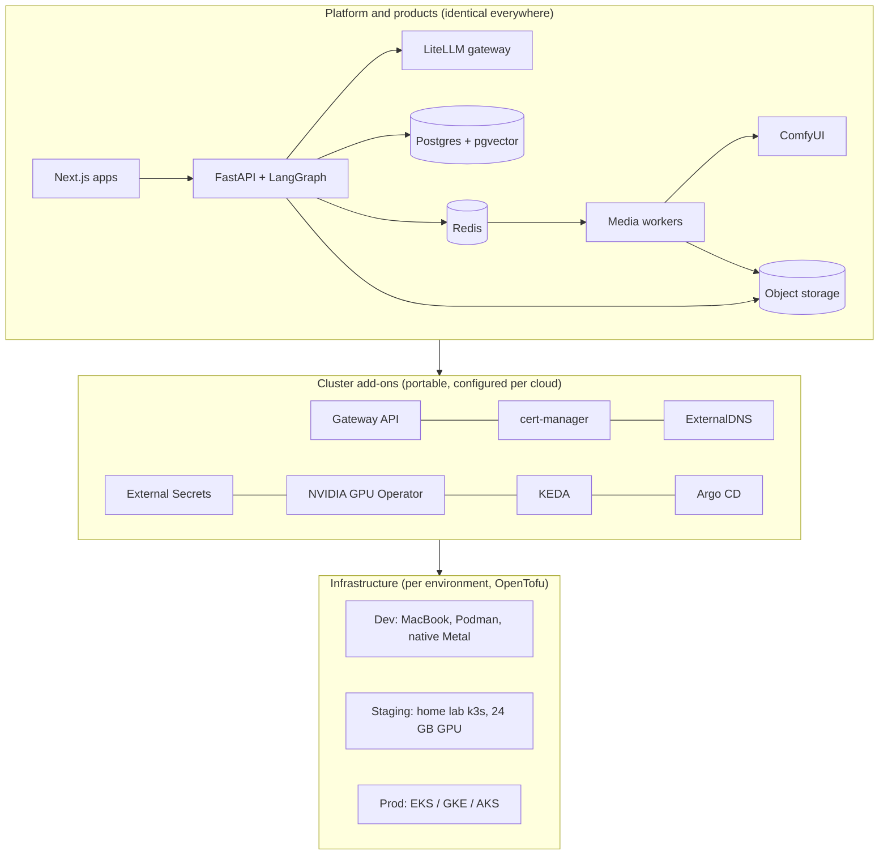
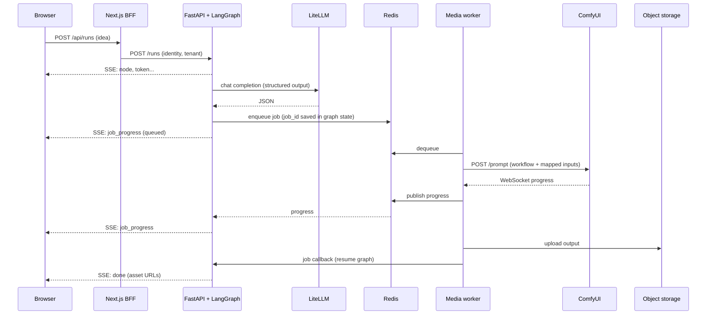

# Architecture

Status: **Draft**, October 2026. Decisions referenced here are recorded in
[`decisions/`](decisions/README.md).

## Goals

- Launch new AI products quickly by reusing one platform core.
- Run identical container images on a MacBook (dev), a home lab k3s cluster (staging) and
  managed Kubernetes on AWS, GCP or Azure (prod).
- Prefer open-source components; keep every AI model swappable.
- Defer auth, billing and observability without making them expensive to add later.

## Three layers

1. **Infrastructure** is the only cloud-aware layer. One OpenTofu module per target, each
   exposing the same outputs: cluster, CPU node pool, GPU node pool, Postgres, Redis, bucket,
   DNS.
2. **Cluster add-ons** are the same tools everywhere, with per-cloud settings.
3. **Platform and products** are identical Helm charts and images. Values overlay as
   `base` → `env` (staging, prod) → `cloud` (homelab, aws, gcp, azure).

## Components

| Component | Responsibility | Scales on |
|---|---|---|
| Next.js app | Product UI; route handlers act as the backend-for-frontend (BFF) and proxy to the API. The browser never calls FastAPI directly. | CPU, stateless |
| FastAPI + LangGraph | Runs product graphs; streams SSE; owns tenant context, identity, usage events, job callbacks | CPU, stateless |
| LiteLLM | One OpenAI-compatible API in front of every LLM backend; model aliases; spend tracking | CPU, stateless |
| Ollama / vLLM | LLM inference: Ollama in dev and staging, vLLM or hosted APIs in prod | GPU |
| Media worker | Consumes Redis jobs, drives ComfyUI, uploads outputs, publishes progress, resumes graphs | Queue depth (KEDA) |
| ComfyUI | Image, music and video generation from versioned JSON workflows | GPU |
| Postgres + pgvector | App data, LangGraph checkpoints, job records, usage events, RAG vectors | Managed in prod |
| Redis | Job queue; pub/sub fan-out of progress events to any API replica | Managed in prod |
| Object storage | Generated media and uploads. SeaweedFS (S3 API) in dev/staging; S3, GCS or Azure Blob in prod | Managed |

## Request flow (generic)

Key properties:

- **Graph state lives in Postgres**, so any API replica can resume any run. No sticky
  sessions.
- **Progress fans out via Redis pub/sub**, so the replica holding a browser's SSE connection
  receives events produced anywhere.
- **GPU work is never awaited inline.** Nodes enqueue and the graph resumes on callback.
- **Outputs are URLs**, never bytes in the stream.

## Platform core vs products

A product is a folder under `products/` containing:

- `product.yaml`: ID, capability bindings, quotas, feature flags
- `graphs/`: LangGraph graphs, registered with the API at startup
- `prompts/`: versioned prompt templates
- `workflows/`: ComfyUI API-format workflow JSON plus `*.map.yaml` input/output maps

Adding a product adds no endpoints for running it: the API's graph registry exposes registered
graphs through generic `/products/{product_id}/runs` routes (ADR-0003). A product may add
authenticated read routes for its own data under `/products/{product_id}/` (ADR-0023). Product UIs
live in one shared Next.js app, `apps/web` (ADR-0014).

## Capabilities

Graphs request **capabilities** (`text.<name>`, `image.generate`, `music.generate`, later
`video.generate`), never specific models. `product.yaml` binds each capability to a
provider (`litellm`, `comfyui`, later `http`). Swapping a model is a config change.
Details: [configuration.md](configuration.md), ADR-0010.

## GPU strategy

| | Dev (Mac) | Staging (home lab) | Prod (cloud) |
|---|---|---|---|
| Hardware | Apple Silicon unified memory | One 24 GB NVIDIA card (RTX 4090 preferred, 3090 budget) | 24 GB L4 / A10-class nodes |
| LLM | Ollama, native (Metal) | Ollama in a pod | vLLM per GPU, or hosted APIs via LiteLLM |
| Media | ComfyUI native, or remote home lab ComfyUI over Tailscale | ComfyUI pod | ComfyUI pool scaled on queue depth, to zero when idle |
| Sharing | Unload LLM before generation | GPU Operator time-slicing; worker unloads LLM before generation | One workload per GPU |

Docker/Podman on macOS cannot reach the Metal GPU, so GPU services run natively on the Mac.

## Seams for later features

| Feature | Seam built now |
|---|---|
| Multi-tenancy | `tenant_id` and `product_id` on every table, job and object key |
| Auth | Identity resolved on every request (stub in dev); Auth.js in Next.js, JWT validated by FastAPI; optional central OIDC (Keycloak / Authentik) later |
| Billing | `usage_events` table: tokens, GPU seconds, jobs per tenant and user |
| Observability | OpenTelemetry instrumentation, structured JSON logs with trace IDs; Langfuse for LLM traces; Prometheus / Grafana / Loki later |
| Quotas | Usage events + per-product limits in `product.yaml` |

## Security baseline

- Ollama and ComfyUI have no authentication. Bind to localhost or the cluster network only;
  never expose publicly. Remote access via Tailscale.
- Pin and review ComfyUI custom nodes; malicious nodes have appeared in community registries.
- MCP servers and tools run least-privilege (read-only DB users, scoped folders).
- Workload identity per cloud; no static cloud keys in pods.
- Rootless containers locally (Podman default).
