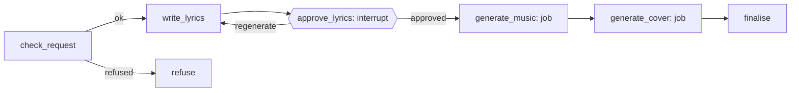

# wd-music-ai

Status: **MVP working.** Built and tested: the guardrail, quota, lyrics with user approval, queued
music and cover jobs, song storage, the read API, sign-in, and the web UI (`apps/web`). ACE-Step 1.5
and FLUX.2 klein have been run for real through the full UI ([ADR-0024](../../docs/decisions/0024-real-model-validation.md)).
Still to do: an upload endpoint, an admin section, billing.

A signed-in user types a song idea. The product writes lyrics, generates a 60-second song
with vocals, and creates cover art.

## MVP scope

**In**

- Sign-in with Google, GitHub and Microsoft (Auth.js)
- Song idea form (free text, optional genre / mood)
- Lyrics generation with a review step: the user can edit or regenerate before audio is
  generated
- 60-second music track (ACE-Step 1.5 via ComfyUI)
- Cover image (FLUX.2 [klein] 4B via ComfyUI)
- Live progress, including queue position
- Song page: title, lyrics, audio player, cover, download
- "My songs" history
- Per-user daily quota
- Content guardrails

**Out (later)**

Payments, sharing / public gallery, longer songs, stems, covers of uploaded audio, video,
Sign in with Apple (needs a paid Apple Developer account), editing a finished song.

## User flow

1. Sign in.
2. Enter a song idea, submit.
3. Watch lyrics stream in.
4. Review: edit lyrics / title, or regenerate. Approve.
5. See queue position and progress for music, then cover.
6. Song page with player, cover and lyrics.

## Graph



| Node | What it does | Capability |
|---|---|---|
| `check_request` | Validates the idea, checks the daily quota (before any model runs), then the guardrail. Refuses artist-voice imitation, reproduced lyrics and disallowed content with fixed messages. Fails closed if the classifier gives no valid answer | `text.moderate` |
| `write_lyrics` | One structured-output call returning `title`, `lyrics`, `style` (music tags), `cover_prompt`. Only the lyrics are streamed to the client as they are written. Output is validated (section tags, enough lines); up to 3 attempts with feedback to the model | `text.lyrics` |
| `approve_lyrics` | Interrupt. The user approves (optionally editing title, lyrics, style) or asks for a new draft (up to 5). Invalid edits ask again with the reason. The lyrics that will be sung are screened once more, whether generated or edited | `text.moderate` |
| `start_music` / `await_music` | Re-checks the quota right before the GPU, queues the music job, then pauses until the worker reports | `music.generate` |
| `screen_cover` | Screens the cover prompt. If refused, a neutral cover is used instead of losing the song | `text.moderate` |
| `start_cover` / `await_cover` | Queues the cover job, then pauses. If the cover job fails the song is still delivered without a cover | `image.generate` |
| `finalise` | Moves the files to `{song_id}/audio.*` and `{song_id}/cover.*`, stores the `songs` row, records `song.created`, returns presigned URLs | none |

Music and cover run **sequentially** on the single staging GPU. The worker unloads the LLM
before each job. In prod they could run in parallel on separate GPUs; the graph should not
assume either.

## Run contract (what the UI builds against)

**Input** (`POST /products/wd-music-ai/runs`): `{"input": {"idea": "...", "genre"?: "...", "mood"?: "..."}}`.
The idea is at most 500 characters, genre and mood at most 40.

**Events**

| Event | Meaning |
|---|---|
| `node` `check_request` / `write_lyrics` `started` | Show the label. A second `started` for `write_lyrics` means the draft is being rewritten: **clear the lyrics streamed so far** |
| `token` (node `write_lyrics`) | The next characters of the lyrics, nothing else |
| `interrupt` kind `approve_lyrics` | Show the draft. `payload`: `title`, `lyrics`, `style`, `regenerations_left`, `error` (non-empty when the previous answer was rejected) |
| `node` `generate_music` / `generate_cover` `started` | Show the label; `job_progress` events carry queue position and progress |
| `done` | `outputs.status` is `done` or `refused` (below) |
| `error` | `code`, `message`, `retryable`. Codes: `lyrics_failed`, `moderation_unavailable`, `quota_exceeded`, or the media job's own code |

**Answering the interrupt** (`POST /runs/{run_id}/resume`):
`{"value": {"action": "approve"}}`, optionally with `title`, `lyrics` and `style` edits, or
`{"value": {"action": "regenerate"}}`.

**Done, finished**: `outputs.status = "done"`, `song_id`, `title`, `lyrics`, `style`, `audio_url`,
`cover_url` (empty if the cover failed), plus `audio_key` and `cover_key` for later re-linking.

**Done, refused**: `outputs.status = "refused"` and `outputs.refusal = {code, message}`; show the
message. Codes: `invalid_request`, `quota_exceeded`, `artist_voice`, `existing_lyrics`,
`disallowed_content`. Messages are fixed text; the classifier's own wording is never shown.

## State

`SongState` (see `wd_music_ai/graphs/song.py`) holds the request (`idea`, `genre`, `mood`), the draft
(`title`, `lyrics`, `style`, `cover_prompt`), the approval bookkeeping, the two job ids, the storage
keys, and `status` (`drafting`, `awaiting_approval`, `generating`, `done`, `refused`). Graph state
holds keys, never file bytes.

## Configuration

```yaml
# product.yaml
id: wd-music-ai
capabilities:
  text.moderate:  { provider: litellm, model: moderator }
  text.lyrics:    { provider: litellm, model: lyrics-writer }
  music.generate: { provider: comfyui, workflow: ace-step-1.5-turbo, defaults: { duration_s: 60 } }
  image.generate: { provider: comfyui, workflow: flux2-klein-4b, defaults: { width: 1024, height: 1024 } }
quotas:
  songs_per_user_per_day: 10
```

Folder layout:

```
products/wd-music-ai/
├─ product.yaml
├─ pyproject.toml            # entry point `wd_ai.products`: the API discovers the product
├─ wd_music_ai/
│  ├─ __init__.py            # register(registry)
│  ├─ graphs/song.py         # the graph
│  ├─ guardrail.py           # classifier calls, fixed refusal messages, fail-closed
│  ├─ lyrics.py              # tag normalisation, validation, streaming of the lyrics field
│  ├─ schemas.py             # structured-output schemas, the approval answer
│  ├─ songs.py               # songs table access and the daily quota
│  └─ prompts.py             # loads prompts/
├─ prompts/                  # lyrics.md, lyrics_request.md, moderation.md, moderation_request.md
├─ workflows/                # ace-step-1.5-turbo and flux2-klein-4b: .json + .map.yaml
├─ evals/                    # guardrail cases and the script that measures them
└─ tests/
```

## Models and licences

| Capability | Model | Licence note |
|---|---|---|
| Lyrics, moderation | Gemma 4 E4B via LiteLLM (ADR-0018) | Apache 2.0 |
| Music | ACE-Step 1.5 (Turbo for speed) | MIT per the model card. Run for real: a 60 s song takes about 77 s; keep lyrics to 12-16 lines (ADR-0024) |
| Cover | FLUX.2 [klein] 4B (ADR-0019) | Apache 2.0 per the model card, VAE from Comfy-Org/flux2-klein. The 9B variant is licensed differently and is not used. About 25 s per cover |
| Not used | YuE2-3B | CC-BY-NC-4.0, non-commercial. Reconsider only if relicensed (ADR-0012) |

## Data

- `songs` (migration 0004): id, tenant_id, product_id, user_id, thread_id, run_id, title, lyrics,
  style, audio_key, cover_key (null if the cover failed), status, created_at
- Object keys: `{tenant_id}/wd-music-ai/{user_id}/{song_id}/audio.{ext}` and `cover.{ext}`
- Usage events: LLM tokens per call, `gpu.seconds` and `job.completed` per job, and one
  `song.created` per finished song. The daily quota counts `song.created` since 00:00 UTC.

## Risks

- **Lyric format (measured):** with the real model, 80% of first attempts passed validation, and every
  failure was the same: the tag and the first line written together (`[verse]First line`). Tags on the
  same line are now split onto their own line, and the same 30 ideas passed 30 of 30. Validation and
  the retry stay as the safety net.
- **Legal:** imitation of real artists or lyrics. Mitigated by `check_request` and model
  choice; add terms of use before public launch.
- **Cost / capacity:** GPU time. Mitigated by quotas, queueing, review-before-generate.
- **Quality:** 60-second structure from ACE-Step. Tune lyric length and tags; consider
  best-of-N later.
- **Dev on Mac:** ACE-Step / FLUX.2 klein may be slow on Apple Silicon. Use the home lab
  ComfyUI over Tailscale, or the stub worker.

## Decisions (prototype)

- Shared Next.js app with route groups (ADR-0014).
- LLM for lyrics and moderation: `gemma4:e4b` via Ollama (ADR-0018). Evaluate lyric quality and
  the `check_request` guardrail on it; `gemma4:12b` is the planned upgrade if either falls short.
- Daily quota: 10 songs per user. Audio format: MP3.
