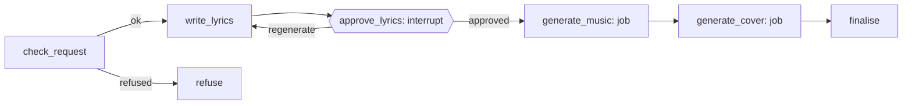

# wd-music-ai

Status: **Planned (MVP)**. First product on the wd-ai platform.

A signed-in user types a song idea. The product writes lyrics, generates a 60-second song
with vocals, and creates cover art.

## MVP scope

**In**

- Sign-in with Google, GitHub and Microsoft (Auth.js)
- Song idea form (free text, optional genre / mood)
- Lyrics generation with a review step: the user can edit or regenerate before audio is
  generated
- 60-second music track (ACE-Step 1.5 via ComfyUI)
- Cover image (Qwen-Image via ComfyUI)
- Live progress, including queue position
- Song page: title, lyrics, audio player, cover, download
- "My songs" history
- Per-user daily quota
- Content guardrails

**Out (later)**

Payments, sharing / public gallery, longer songs, stems, covers of uploaded audio, video,
Sign in with Apple (needs a paid Apple Developer account), editing a finished song.

## User flow

1. Sign in.
2. Enter a song idea, submit.
3. Watch lyrics stream in.
4. Review: edit lyrics / title, or regenerate. Approve.
5. See queue position and progress for music, then cover.
6. Song page with player, cover and lyrics.

## Graph



| Node | What it does | Capability |
|---|---|---|
| `check_request` | Quota check; refuses requests to reproduce existing lyrics, imitate a named artist's voice, or produce disallowed content | `text.moderate` (LiteLLM) |
| `write_lyrics` | One structured-output call returning `title`, `lyrics` (with `[verse]` / `[chorus]` / `[bridge]` tags), `style` (music tags), `cover_prompt` | `text.lyrics` (LiteLLM) |
| `approve_lyrics` | Interrupt. User edits / approves / regenerates | none |
| `generate_music` | Enqueues music job; graph pauses until the worker's callback | `music.generate` (ComfyUI) |
| `generate_cover` | Screens the cover prompt, enqueues image job | `image.generate` (ComfyUI) |
| `finalise` | Stores song record, writes usage events, emits `done` | none |

Music and cover run **sequentially** on the single staging GPU. The worker unloads the LLM
before each job. In prod they could run in parallel on separate GPUs; the graph should not
assume either.

### State (sketch)

```python
class SongState(TypedDict):
    tenant_id: str
    user_id: str
    idea: str
    title: str | None
    lyrics: str | None
    style: str | None
    cover_prompt: str | None
    music_job_id: str | None
    cover_job_id: str | None
    audio_url: str | None
    cover_url: str | None
    status: Literal["drafting", "awaiting_approval", "generating", "done", "refused", "failed"]
```

## Configuration

```yaml
# product.yaml (planned)
id: wd-music-ai
capabilities:
  text.moderate:  { provider: litellm, model: moderator }
  text.lyrics:    { provider: litellm, model: lyrics-writer }
  music.generate: { provider: comfyui, workflow: ace-step-1.5-turbo, defaults: { duration_s: 60 } }
  image.generate: { provider: comfyui, workflow: qwen-image-fp8, defaults: { width: 1024, height: 1024 } }
quotas:
  songs_per_user_per_day: 10
```

Planned folder layout:

```
products/wd-music-ai/
├─ product.yaml
├─ product.dev.yaml          # optional overrides (e.g. stub or lighter workflows)
├─ graphs/song.py
├─ prompts/
│  ├─ lyrics.md
│  └─ moderation.md
└─ workflows/
   ├─ ace-step-1.5-turbo.json
   ├─ ace-step-1.5-turbo.map.yaml
   ├─ qwen-image-fp8.json
   └─ qwen-image-fp8.map.yaml
```

## Models and licences

| Capability | Model | Licence note |
|---|---|---|
| Lyrics, moderation | Qwen or Llama via LiteLLM | Check the specific model's licence (Llama has its own community licence) |
| Music | ACE-Step 1.5 (Turbo for speed) | Permissive, commercial use of outputs stated on model card. Sources disagree on MIT vs Apache 2.0: **verify before launch** |
| Cover | Qwen-Image (fp8 / GGUF for 24 GB) | Believed Apache 2.0: **verify before launch** |
| Not used | YuE2-3B | CC-BY-NC-4.0, non-commercial. Reconsider only if relicensed (ADR-0012) |

## Data

- `songs`: id, tenant_id, product_id, user_id, thread_id, title, lyrics, style, audio_key,
  cover_key, status, created_at
- Object keys: `{tenant_id}/wd-music-ai/{user_id}/{song_id}/audio.{ext}` and `cover.png`
- Usage events: LLM tokens per call, GPU seconds per job, one `song.created` event

## Risks

- **Legal:** imitation of real artists or lyrics. Mitigated by `check_request` and model
  choice; add terms of use before public launch.
- **Cost / capacity:** GPU time. Mitigated by quotas, queueing, review-before-generate.
- **Quality:** 60-second structure from ACE-Step. Tune lyric length and tags; consider
  best-of-N later.
- **Dev on Mac:** ACE-Step / Qwen-Image may be slow on Apple Silicon. Use the home lab
  ComfyUI over Tailscale, or the stub worker.

## Decisions (prototype)

- Shared Next.js app with route groups (ADR-0014).
- LLM for lyrics and moderation: `gemma4:e4b` via Ollama (ADR-0018). Evaluate lyric quality and
  the `check_request` guardrail on it; `gemma4:12b` is the planned upgrade if either falls short.
- Daily quota: 10 songs per user. Audio format: MP3.
